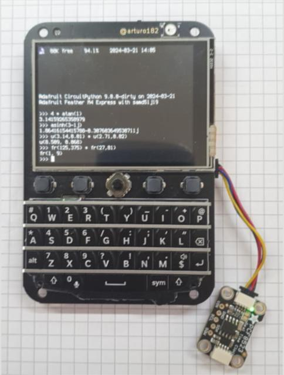
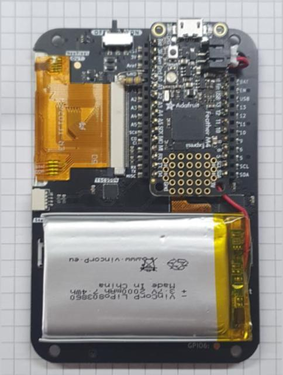
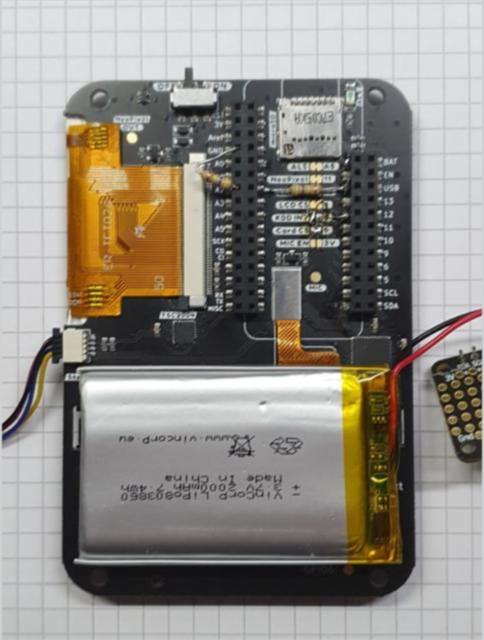
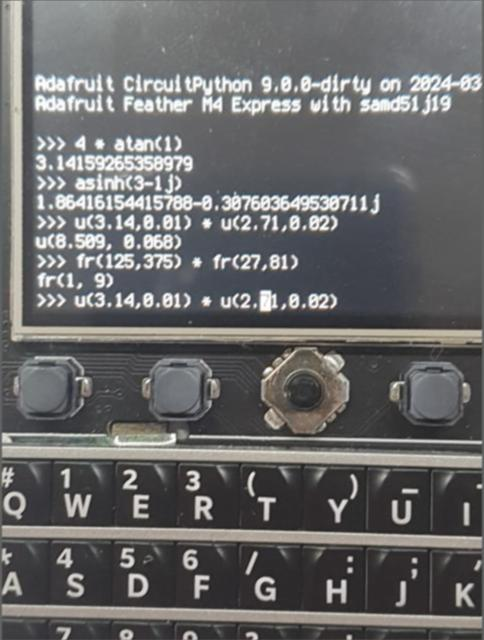
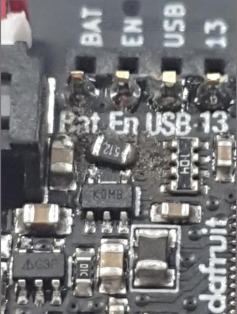

# circuitpython-calculator
Handheld Calculator running on CircuitPython. The hardware is a [Keyboard Featherwing V2](https://www.solder.party/docs/keyboard-featherwing/rev2/) from [arturo182](https://github.com/arturo182), an [Adafruit Feather M4 Express](https://www.adafruit.com/product/3857) and a 2000mAh LiPo battery. Circuitpython is a custom build which enables float64 (double) math as well as the cmath module. The supplied patches `circuitpython-*.diff` should work on 9.0.x and 9.1.x, respectively - the build script automates the build process, and sits on top of [Adafruit's build-circuitpython](https://learn.adafruit.com/building-circuitpython/build-circuitpython). Make sure you understand this first.

All of this is still very raw but workable.

More information about building this device is [here](https://adafruit-playground.com/u/hmilz/pages/building-a-scientific-handheld-calculator-with-double-precision-math-complex-math-uncertainties-and-fractions).

The supplied patch implements the following: 

* it enables FP64 math on the supported platforms (atmel-samd raspberrypi espressif mimxrt10xx) 
* it adds a numerical integration module `ulab.scipy.integrate`. 

The `CIRCUITPY` contains the scripts that are supposed to be uploaded to your board. 

* `umath.py` is a wrapper on top of FP64 math and cmath, and transparently invokes numpy.array, float or complex routines for the math functions. 
* `uncertainty.py` is a rewrite / port of Python uncertainties to Circuitpython (mainly omitting several dependencies) and works in a very similar way. 
* `ufractions.py` does the same for Python fractions. 

## Building the image
Edit the build script 'circuitpython-prep.sh' to prepare the local repo, then run it, then build the desired image. 

## CIRCUITPY/Bitmaps
contains blinka images converted from the C source code. 

## CIRCUITPY/Decimal
contains some math on top of jepler-udecimal (https://github.com/jepler/Jepler_CircuitPython_udecimal). umath.py complements hyperbolic and some other functions, and cdmath.py, well, complex decimal math. Abandoned in favor of modifying Circuitpython mainly due to memory consumption but workable. Maybe useful for someone. 

## Images
The images directory contains the images that were originally in the Adafruit Playgound article. It seems I cannot upload them there any more. 

Fig. 1 A couple of sample commands. 

Fig. 2 View from the backside. 

Fig. 3 View from the backside with the Feather M4 removed. You can see the resistors for the voltage divider. 

Fig. 4 Some commands enlarged.

Fig. 5 The battery charge current hack. 

